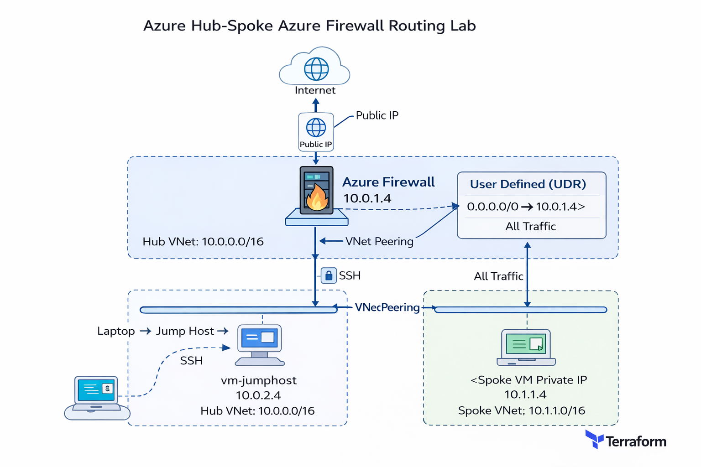

# Azure Hub-Spoke Azure Firewall Routing Lab

## Overview

This project demonstrates a Hub-Spoke network architecture in Azure using Terraform, where outbound traffic from a spoke virtual network is routed through Azure Firewall in the hub.

The goal of this lab was to design, deploy, validate, and troubleshoot a centralized egress architecture using Azure-native security controls.

## Architecture Diagram



---

## Key Components

### Hub VNet
- Address space: `10.0.0.0/16`
- Azure Firewall subnet: `10.0.1.0/26`
- Jump host subnet: `10.0.2.0/24`
- Azure Firewall private IP: `10.0.1.4`

### Spoke VNet
- Address space: `10.1.0.0/16`
- Workload subnet: `10.1.1.0/24`
- Spoke VM private IP: `10.1.1.4`

---

## Routing Design

- A User Defined Route (UDR) is applied to the spoke subnet:
  - `0.0.0.0/0 → 10.0.1.4`
- All outbound traffic from the spoke VM is forced through Azure Firewall
- Direct internet egress from the spoke is disabled by design

---

## Azure Firewall Configuration

- Azure Firewall deployed in the hub network
- Firewall Policy attached for centralized rule management
- Network rules configured to allow outbound traffic (HTTP, HTTPS, DNS)
- Firewall performs NAT and becomes the **egress identity** for the spoke

---

## Access Model

* Jump host deployed in hub with public IP
* Spoke VM is private-only (no public IP)
* SSH access path:

```text
Laptop → Jump Host → Spoke VM
```

---

## Validation

### Test Commands

From the spoke VM:

```bash
curl -4 http://ifconfig.me/ip
curl -4 https://ifconfig.me/ip
```

### Result

```text
Azure Firewall Public IP
```

### What This Confirms

* Outbound traffic is not using the default Azure internet path
* Traffic is successfully routed through Azure Firewall
* Azure Firewall is performing NAT and acting as the public egress point

---

## Inbound Access (DNAT)

In addition to centralized outbound routing, Azure Firewall was used to publish a private web server in the spoke network using a DNAT rule.

### Inbound Traffic Flow

```text
Internet → Azure Firewall Public IP → DNAT → 10.1.1.4 (NGINX Web Server)

### Browser Validation

Accessing the Azure Firewall public IP from a browser successfully returned the NGINX default page.

This confirmed:

- The web server remained private with no public IP
- Azure Firewall controlled inbound access
- DNAT correctly forwarded traffic to the internal workload

### Screenshot


